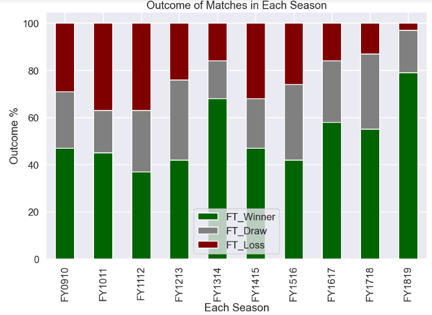
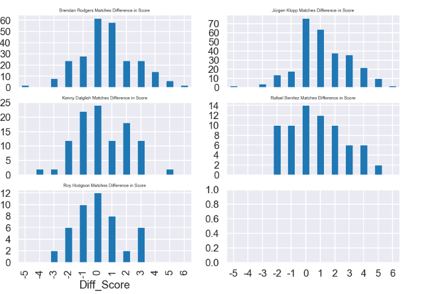
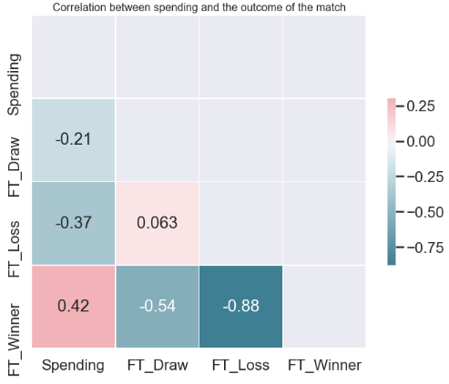

# Liverpool's Title Run in 30 Year: Cluster Analysis - Data Science Project Overview 

- Comparing Liverpool's last 10 years of performances with transfer spending each season --> there are evidence to suggest more spending leads to fewer matches been lost but there are no concrete evidence to suggest more spending lead to winning more matches.
- Built a dashboard for Liverpool's performance in the last decade on Streamlit platform which is free and easy to share with stakeholders.
- Optimized K-Means and Hierarchical clustering methods to reach the conclusion of the analysis.
- Built a client facing API using flask and Heroku to view that on the [Streamlit](https://liverpooldashboard.herokuapp.com/).

# Code and Resources Used

**Python Version**: 3.7

**Packages**: pandas, numpy, sklearn, matplotlib, seaborn,json

**Data Resource**: https://www.football-data.co.uk/englandm.php

**For Web Framework Requirements**: pip install -r requirements.txt

**Flask and Heroku Production**: https://towardsdatascience.com/how-to-deploy-your-data-science-as-web-apps-easily-with-python-955dd462a9b5

# Data Cleaning
After downloading the data, I needed to clean it up so that it was usable for our analysis. I made the following changes and created the following variables:

Creating new variables: 

- MatchWinners: Whether Liverpool won,draw or lost the match ?
- FT_Winner: Whether Liverpool won or not?
- FT_Draw: Whether Liverpool draw or not?
- FT_Loss: Whether Liverpool lost or not?
- Diff_Score: Difference in Goals,Final Result of the Match

# EDA

 

 

**Insight**

- The first half of the decade Liverpool had more loss compared to draw and second half of the decade it converted loss into draws, which has resulted in more winners last season.

- In the Last 10 Year, Liverpool have won over 50% of their games however the ratio of Draw and losses are pretty similar.

- Under Kloop the average target shot for both Home and away matches are lowest among his peers however he still has more wins compare to other managers. 

- Jürgen Klopp has a distribution toward right hand side, he has the most draws and majority of this winners are difference of 1 or 2 goals.

- Liverpool has more shots taken at Home(HS) and which correlates with shots on target at home matches (HST).So, we can say that liverpool win more matches at home because they take more shots and hit the target.

- From the graph above, Liverpool has spend on average £43.5M in transfer each season between 2011-2016 and last season liverpool spend £143M - Buying a new goalkeeper for £56M. The Correlation between transfers and winning can be seen through each season - more spending has resulted in more wins.

# Cluster Analysis 

## Is spending more money on transfers the reason for Liverpool's success?

  

In the plot above the elbow is at k=4 indicating the optimal k for this dataset is 4

### Cluster 1 (Spending £34M - median spending results in win or draw)

- Takes less shots during away matches.
- Losing more games at home.
- The gap between percentage of wins and draws isn't huge.
- Wins twice as many matches at home then away.

### Cluster 2 (Spending £51M - more spending more winning)

- Spending more money on transfers

- Scores more goals at both full time and half time

- 70% of the matches result in winning

- percentage of draws and losses are the same.

- Match result in higher goal difference

### Cluster 3 (Spending £23M - less spending more losing)

- Losing twice as many matches than other groups
- Losing more matches away
- Fewer matches result in draw 
- Match result in fewer goal difference meaning majority of the matches are won or lost.

### Cluster 4 (Spending £49M - more spending more draws)

- Scoring more goal on away matches

- 34% of the matches result in draws

- Higher percentage of shots are hit on target in away matches (this could be due to more shots been taken)

- Match result in fewer goal difference meaning majority of the matches are won or draw.

Conclusion from K-Mean Clustering - We can see there are some evidence to suggest spending more money can result in losing less matches which means the final result is either draw or win. However, there are no concrete evidence to suggest more spending leads to more matches won and this can be seen from Cluster 2 (more spending more winning) and Cluster 4 (more spending more draws). As a Liverpool fan, I can say maybe more spending on the right players and good team environment can lead to winning more matches.

# [Streamlit Dashboard](https://liverpooldashboard.herokuapp.com/)
Streamlit 

# Production

## Setup: 
1. Procfile

2. [app.py](https://github.com/Jaspreetsm21/Liverpool_title_run/blob/master/app.py) 

Streamlit python script for the dashboard 

3. Setup.sh

4. requirements

